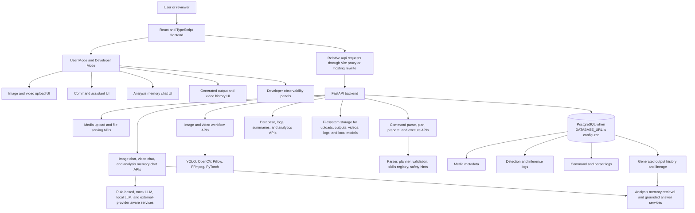
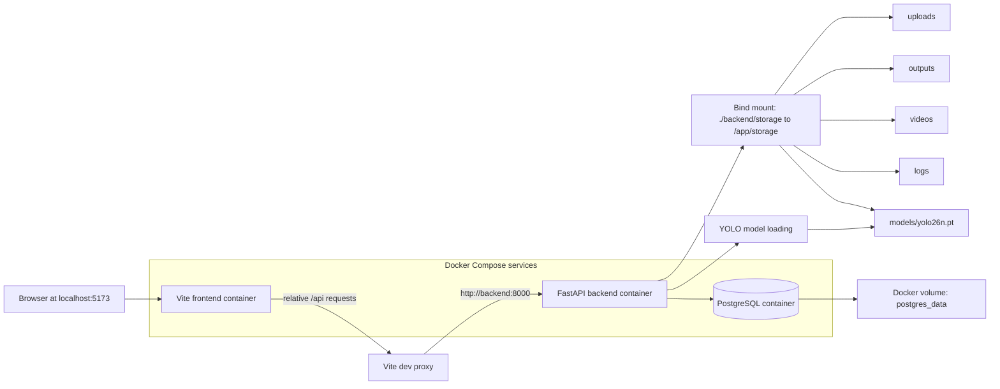
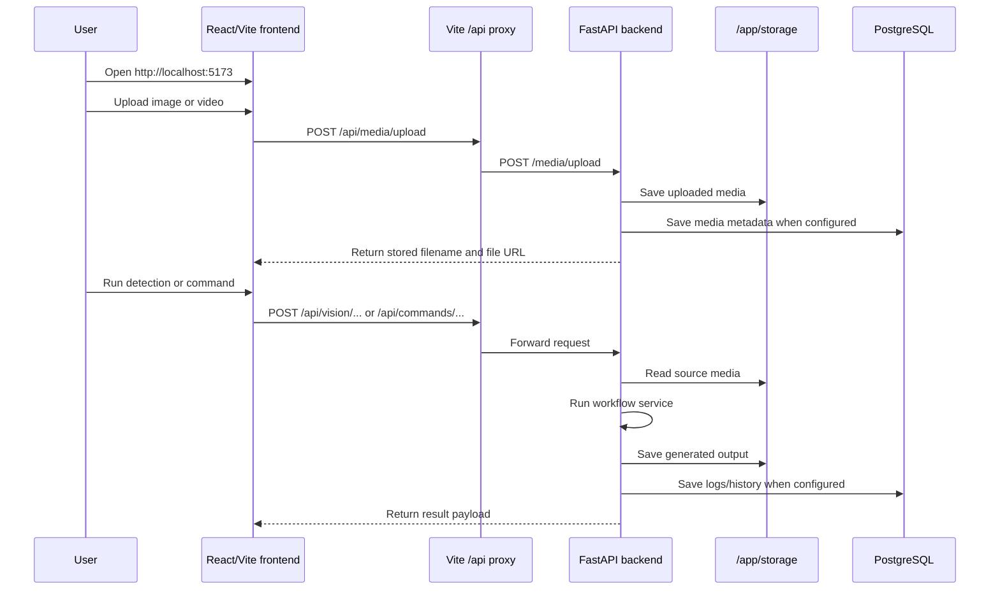
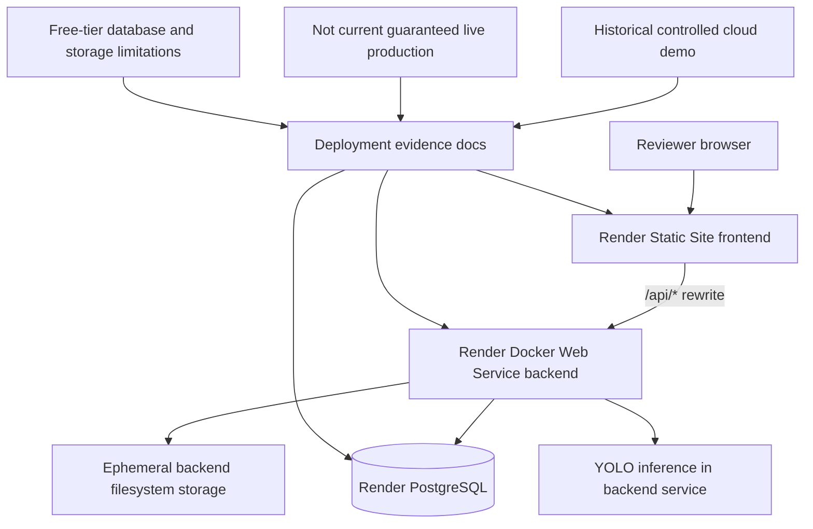
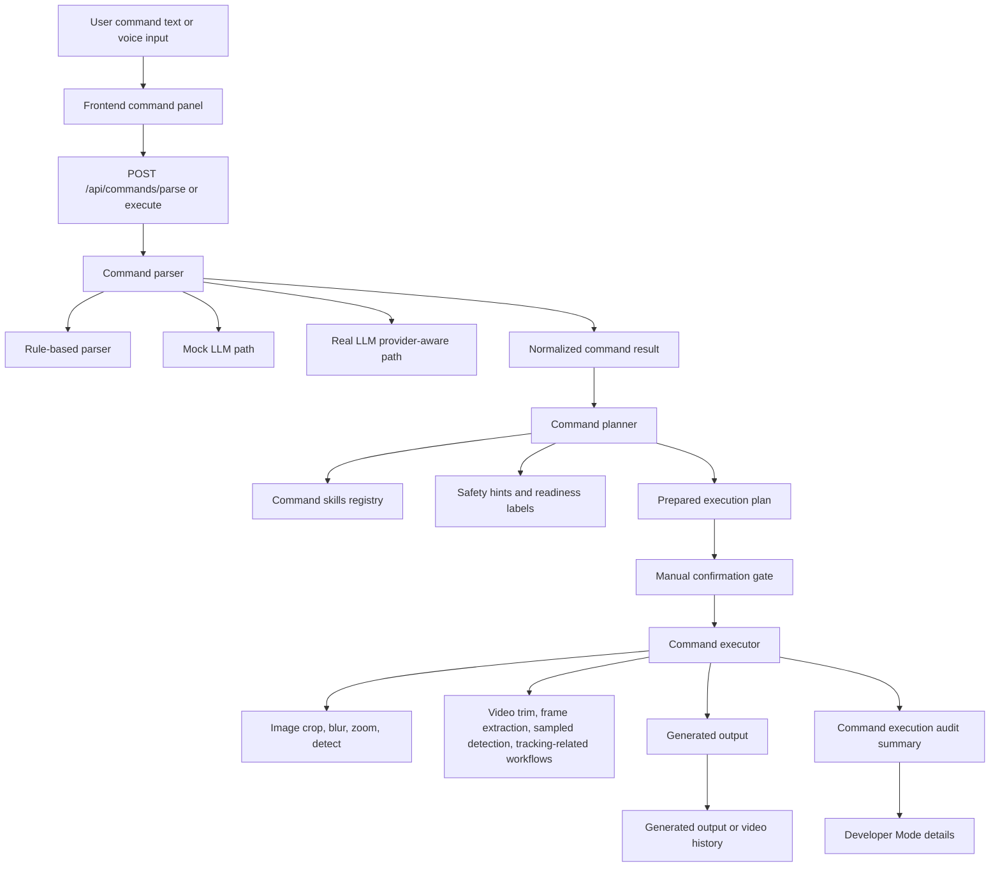
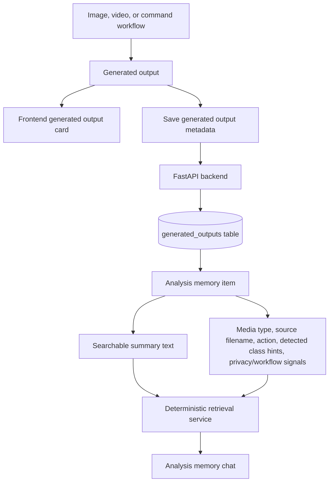
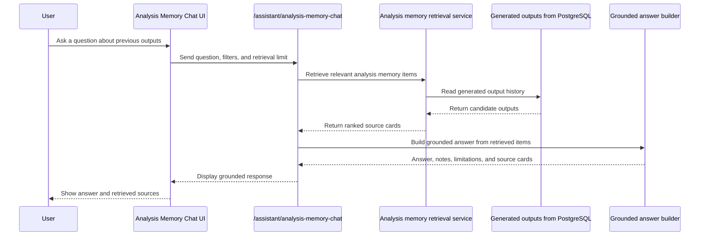
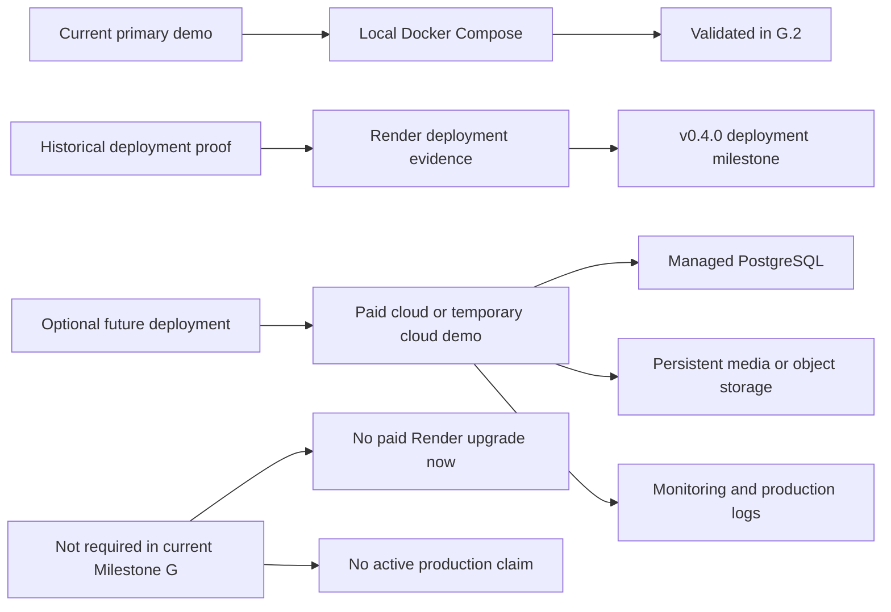

# G.5 Architecture and Deployment Diagrams

This document provides current architecture and deployment diagrams for VisionCommand AI during Milestone G.

The diagrams are written in Mermaid so they render directly in GitHub Markdown.

## Purpose

G.5 makes the project easier to understand visually for:

- GitHub visitors
- recruiters
- technical interviewers
- portfolio reviewers
- future maintainers

The diagrams show implemented behavior and clearly label historical or optional deployment paths.

## Current architecture summary

VisionCommand AI is a full-stack AI media assistant.

It combines:

- React and TypeScript frontend
- FastAPI backend
- YOLO, OpenCV, Pillow, FFmpeg, and PyTorch-based media workflows
- PostgreSQL-backed persistence
- command parsing, planning, execution, and audit metadata
- structured image and video chat
- analysis-memory retrieval over generated outputs
- Docker Compose local demo setup
- historical Render deployment evidence

## Full system architecture



## Local Docker architecture

The current primary demo path is local Docker.



Current local ports:

| Service | Local port | Purpose |
| --- | --- | --- |
| frontend | `5173` | React/Vite app |
| backend | `8000` | FastAPI backend |
| postgres | `5432` | Local PostgreSQL database |

## Local Docker request flow



## Historical Render deployment architecture

The Render deployment is historical evidence, not the current guaranteed active demo path.



Safe claim:

```text
VisionCommand AI was previously deployed on Render as a controlled public cloud demo.
```

Unsafe claim:

```text
VisionCommand AI currently has a guaranteed active production cloud deployment.
```

## Command execution architecture



## Generated output history and analysis memory flow



## Analysis-memory RAG-style flow



This is RAG-style because the answer is grounded in retrieved project-generated analysis context.

Current boundary:

- no external web search
- no external vector database
- no claim of deep semantic retrieval
- no claim that the system reasons from raw images or videos during memory chat
- answers are grounded in saved/generated analysis outputs

## Deployment status view



## Project explanation

A concise explanation:

```text
VisionCommand AI is a full-stack applied AI media assistant. The frontend lets users upload images or videos, run object detection and editing workflows, execute natural-language commands, and ask grounded questions about previous generated outputs. The FastAPI backend handles media processing, command intelligence, LLM-aware assistant paths, persistence, and analysis-memory retrieval. PostgreSQL stores workflow metadata, generated output history, logs, and analysis memory sources. The current reliable demo path is Docker Compose, while an earlier Render deployment is documented as historical cloud deployment evidence.
```

## Boundary

G.5 does not add new application features.

G.5 does not create a new deployment.

G.5 does not add screenshots or generated image files.

G.5 does not claim v1 readiness.

G.5 only adds visual architecture and deployment documentation for the current implemented project state.
